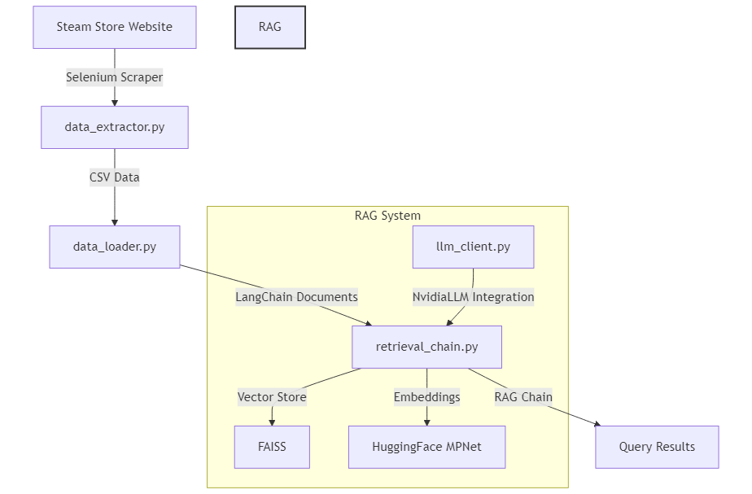

# AI Steam Game Price Forecasting

An advanced AI-powered system for analyzing and forecasting Steam game prices using Retrieval Augmented Generation (RAG) and Large Language Models.

## 🚀 System Overview

This project implements a sophisticated RAG-based system that combines real-time Steam data extraction with advanced language models to provide intelligent game price analysis and forecasting.

## 🏗️ Architecture

The system consists of four main components:

1. **Data Extraction** (`data_extractor.py`)
   - Selenium-based scraper for Steam's most played games
   - Real-time collection of game prices and player statistics
   - Automated CSV export with daily timestamps

2. **Data Processing** (`data_loader.py`)
   - Robust data preprocessing pipeline
   - Conversion to LangChain Document format
   - Type-safe implementation with error handling

3. **LLM Integration** (`llm_client.py`)
   - Custom Nvidia LLM implementation
   - LangChain-compatible interface
   - Configurable model parameters and streaming support

4. **RAG Implementation** (`retrieval_chain.py`)
   - FAISS vector store for efficient similarity search
   - HuggingFace MPNet embeddings
   - Advanced prompt engineering for accurate analysis
   - Retrieval-augmented generation chain



## 🛠️ Technical Stack

- **Web Scraping**: Selenium, Chrome WebDriver
- **Data Processing**: Pandas, NumPy
- **Vector Store**: FAISS
- **Embeddings**: HuggingFace sentence-transformers
- **LLM Integration**: Custom Nvidia API implementation
- **RAG Framework**: LangChain

## 🔧 Setup and Usage

1. Install dependencies:
```bash
pip install -r requirements.txt
```

2. Configure environment variables for API access
```bash
NVIDIA_API_KEY=your_api_key_here
```

3. Run the data collection:
```bash
python data_extractor.py
```

4. Remove NaN values:
```bash
python steam_game_price_analysis.py
```

5. Execute analysis queries through the RAG system:
```bash
python main.py
```


## 🎯 Key Features

- Real-time Steam data extraction
- Robust error handling and data validation
- Configurable RAG system with FAISS vector store
- Custom LLM integration with streaming support
- Type-safe implementation with comprehensive documentation

## 📊 Performance

- Efficient similarity search with FAISS
- Optimized embeddings using MPNet
- Streaming response generation
- Configurable retrieval parameters

## 📝 License

MIT License

